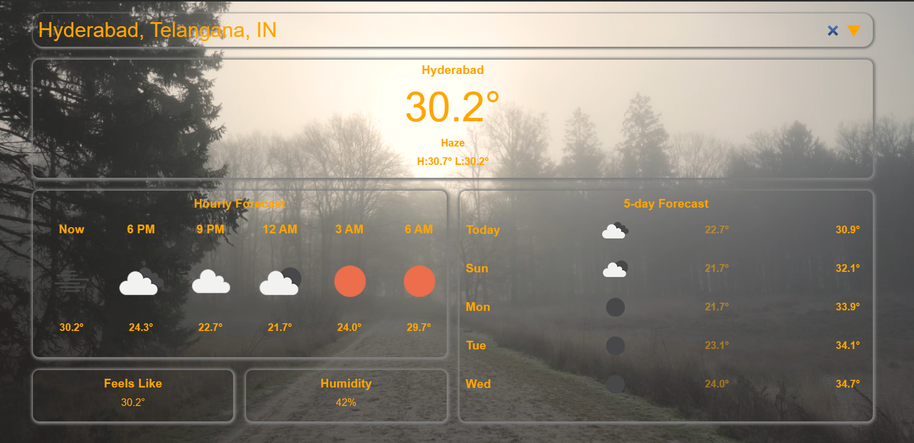

# Weather App using OpenWeatherAPI

This Weather App is designed to provide users with current weather information, including temperature, city name, weather description, minimum and maximum temperature, five-day forecast, hourly forecast, feels like temperature, humidity, and background video changer according to temperature and weather description. It utilizes HTML, CSS, and JavaScript and integrates OpenWeatherAPI for weather data retrieval.

## Table of Contents..

- [Demo](#demo)
- [Features](#features)
- [Technologies Used](#technologiesused)
- [How to Use](#usage)
- [Credits](#credits)
- [Contributing](#contributing)
- [License](#license)

## Demo

[View Demo](https://weather-api-app-mounika.netlify.app/)<!-- Add the link to your live demo here -->

 <!-- Add a screenshot or gif of your app -->

## Features

- **Responsive Design:** The app is designed to be responsive across various devices, ensuring a consistent user experience.
- **Search by Location:** Users can search for weather information by entering the location name.
- **Current Weather Information:** Provides real-time weather data including temperature, weather description, minimum and maximum temperature, feels like temperature, and humidity.
- **Five-day Forecast:** Displays the forecast for the next five days.
- **Hourly Forecast:** Provides hourly weather forecast details.
- **Background Video Changer:** The background video changes dynamically according to the temperature and weather description, enhancing the visual experience.

## Technologies Used

- HTML5: Structure of the web application.
- CSS3: Styling for the layout and visual appearance.
- JavaScript: Enables dynamic functionality and interactions.
- OpenWeatherAPI: Retrieves weather data for the specified location.

## How to Use

1. **Clone Repository:**
   Clone the repository to your local machine using the following command:

2. **Set Up OpenWeatherAPI:**
   Obtain an API key from OpenWeatherAPI (https://openweathermap.org/api) and replace `<YOUR_API_KEY>` in the JavaScript file with your API key.

3. **Run the App:**
   Open the `index.html` file in your preferred web browser to run the Weather App.

4. **Search for Weather:**
   Enter the location in the search bar and press Enter to retrieve weather information.

5. **Explore Weather Details:**
   View current weather details, five-day forecast, and hourly forecast. Experience the background video changing according to the weather.

## Credits

- Weather data is provided by [OpenWeatherAPI](https://openweathermap.org/api).
- Background videos are sourced from various royalty-free stock video platforms.

## Contributions

Contributions are welcome! If you'd like to contribute to the project, feel free to submit a pull request.

## License

This Weather App is open-source and available under the [MIT License](LICENSE).

---

Feel free to reach out if you have any questions, suggestions, or feedback!
